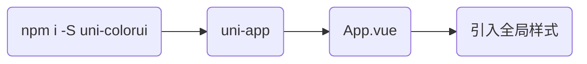

# uni-colorui

### 鲜亮的高饱和色彩，专注视觉的小程序组件库 https://www.color-ui.com/

#### 1.[完整安装包下载](https://www.color-ui.com/)

#### 2.npm使用（[uni-app](https://uniapp.dcloud.io/collocation/App)）



```
<style>
@import "uni-colorui/theme/main.css";
@import "uni-colorui/theme/icon.css";
</style>
```

#### 3.[仓库地址](https://github.com/weilanwl/ColorUI)

#### 4.[开源协议](https://raw.githubusercontent.com/weilanwl/ColorUI/master/LICENSE)

#### 5.[注意事项](https://raw.githubusercontent.com/weilanwl/ColorUI/master/Colorui-UniApp/colorui/main.css)

```
使用ColorUi开发扩展与插件时，请注明基于ColorUi开发 
```

